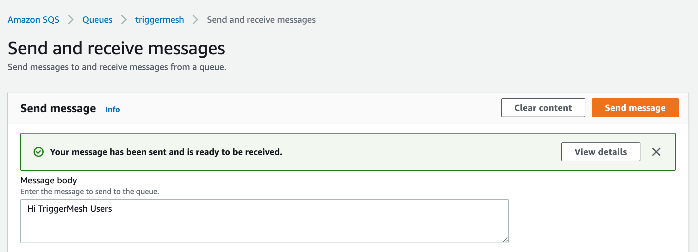

# Creating a Source

!!! Info "Installation"
    Make sure you have completed the installation [procedure](installation.md) before continuing with any of the guides.

In this guide we will create a point to point Bridge between an AWS SQS queue and a microservice application called `sockeye` which displays events in a web interface. This simple flow is depicted below.


We will create:

- [x] The `sockeye` target which serves as an event display.
- [x] The `AWSSQSSource` which consumes events from an AWS SQS queue.

!!! tip "Kubernetes namespace"
    The Kubernetes namespace to contain these objects as well as the secret for AWS SQS credentials is up to your choice, and should be the same for all objects.

## Sockeye CloudEvents viewer display

First of all, we need to have a tool to see the events that come from our source.

Create a `sockeye` service by saving the following YAML manifest in a file called `sockeye.yaml` and applying it to your Kubernetes cluster:

```yaml
apiVersion: serving.knative.dev/v1
kind: Service
metadata:
  name: sockeye
spec:
  template:
    spec:
      containers:
        - image: docker.io/n3wscott/sockeye:v0.7.0@sha256:e603d8494eeacce966e57f8f508e4c4f6bebc71d095e3f5a0a1abaf42c5f0e48
```

```
kubectl apply -f sockeye.yaml
```

Open the web interface in a browser at the URL found with the following command:

```shell
$ kubectl get ksvc sockeye -o=jsonpath='{.status.url}'
```

!!! tip "Minikube"
    This guide assumes that the Knative service can be addressed from your browser. When using
    minikube make sure to configure the [Magic DNS option](https://knative.dev/docs/install/yaml-install/serving/install-serving-with-yaml/#configure-dns).

## Create a AWS SQS Event source

You can explore the specification of the object using the `kubectl explain` command. You will see that you need the ARN (i.e Amazon Resource Name) of your AWS SQS queue and the AWS API keys that give you access to SQS.


```console
$ kubectl explain awssqssource.spec
KIND:     AWSSQSSource
VERSION:  sources.triggermesh.io/v1alpha1

RESOURCE: spec <Object>

DESCRIPTION:
     Desired state of the event source.

FIELDS:
   adapterOverrides     <Object>
     Kubernetes object parameters to apply on top of default adapter values.

   arn  <string> -required-
     ARN of the Amazon SQS queue to consume messages from. The expected format
     is documented at
     https://docs.aws.amazon.com/IAM/latest/UserGuide/list_amazonsqs.html#amazonsqs-resources-for-iam-policies.

   auth <Object>
     Authentication method to interact with the Amazon SQS API.

   endpoint     <Object>
     Customizations of the AWS REST API endpoint.

   messageProcessor     <string>
     Name of the message processor to use for converting SQS messages to
     CloudEvents. Supported values are "default" and "s3".

   receiveOptions       <Object>
     Options that control the behavior of message receivers.

   sink <Object> -required-
     The destination of events sourced from Amazon SQS.
```

Create a secret called `awscreds` which contains your access key and your secret key like so:

```console
kubectl create secret generic awscreds \
  --from-literal=access_key_id=<ACCESS_KEY_ID> \
  --from-literal=secret_access_key=<SECRET_ACCESS_KEY>
```

!!! tip "AWS Credentials"
    Setting up AWS Credentials tips can be found [here](https://docs.triggermesh.io/cloud/sources/awssqs/#api-credentials).

Then, write a YAML manifest for your SQS source similar to the one below. The following sample points to a SQS queue, referenced by its ARN and a secret called `awscreds`.


```yaml
apiVersion: sources.triggermesh.io/v1alpha1
kind: AWSSQSSource
metadata:
  name: sqs-guide
spec:
  arn: arn:aws:sqs:us-east-1:123456789012:triggermesh
  auth:
    credentials:
      accessKeyID:
        valueFromSecret:
          key: access_key_id
          name: awscreds
      secretAccessKey:
        valueFromSecret:
          key: secret_access_key
          name: awscreds
  sink:
    ref:
      apiVersion: serving.knative.dev/v1
      kind: Service
      name: sockeye
```

Create this source with the `kubectl apply -f` command.

## Results

Verify that your source is ready with:

```console
$ kubectl get awssqssource
NAME          READY   REASON   SINK                                      AGE
sqs-guide     True             http://sockeye.sebgoa.svc.cluster.local   3m57s

```

You can go to the AWS SQS console and put a message in the queue as shown in the following screenshot:



The message will get consumed by the source and sent directly to Sockeye in a [CloudEvent](https://cloudevents.io/) format. Below is a screenshot of Sockeye displaying the received event.


!!! tip "Minikube"
    Sockeye's URL at minikube will need to be added the networking layer port.
    ```console
    kubectl get ksvc sockeye
    NAME      URL                                            LATESTCREATED   LATESTREADY     READY   REASON
    sockeye   http://sockeye.sebgoa.192.168.49.2.sslip.io   sockeye-00001   sockeye-00001   True
    ```

    Replace the network layer name and service if not using kourier.

    ```console
    kubectl get svc \
      -n kourier-system kourier \
      -o jsonpath='{range .spec.ports[*]}{.port}{"\t"}--> {.nodePort}{"\n"}{end}'
    ```

    Use the retrieved port for the HTTP protocol.
    ```
    # If the networking layer were using 31280 nodeport for HTTP
    http://sockeye.sebgoa.192.168.49.2.sslip.io:31280/
    ```


## More about Sources

Learn more about Sources on the [Concepts page](../concepts/sources.md).
