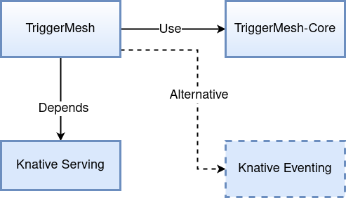

# Knative And TriggerMesh At Kubernetes

To understand TriggerMesh and Knative relationship a futher look at its internal components is needed:

- [TriggerMesh Core](https://github.com/triggermesh/triggermesh-core) provides eventing building blocks like Brokers and Triggers.
- [TriggerMesh](https://github.com/triggermesh/triggermesh) provides the range of source and target components to communicate with external systems while building your event driven applications.
- [Knative Serving](https://github.com/knative/serving) deploys a serverless runtime on top of Kubernetes.
- [Knative Eventing](https://github.com/knative/eventing) deploys an eventing runtime on top of Kubernetes.

## Dependencies

- `TriggerMesh` sources and targets use serverless for exposing services and scaling and need `Knative Serving` to be installed.
- `TriggerMesh Core` does not depends on any external project and will run on a vanilla Kubernetes cluster.

## Deployment Choices

- `TriggerMesh Core` is an standalone component that can be deployed on its own, it will manage brokers that ingest and deliver [CloudEvents](https://cloudevents.io/) from producers to consumers.

- `TriggerMesh` sources and targets need `Knative Serving` and the tuple can be deployed at Kubernetes to provide a set of components that integrate with external systems. Although with the lack of a Broker you might run into point-to-point issues, this can be a valid deployment option for very simple low traffic scenarios.

- `TriggerMesh`, `Knative Serving` and `TriggerMesh Core` are our go to bundle, containing all building blocks to develop event driven applications, integrating external systems declaratively.

- If you are already using `Knative Eventing` you might want to stick to it instead of installing `TriggerMesh Core`. In such case you only need to install `TriggerMesh` sources and targets and use them out of the box.

<figure markdown="1">

</figure>
