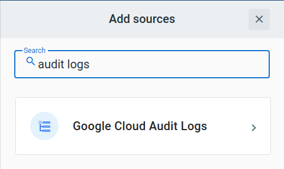
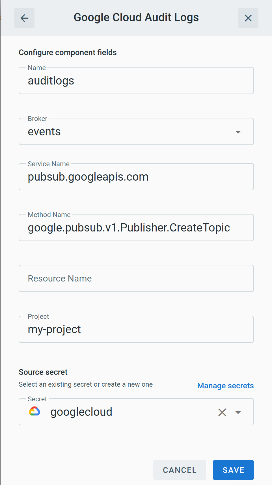
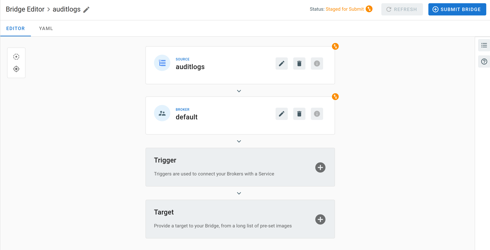

# Event Source for Google Cloud Audit Logs

This event source receives messages from a [Google Cloud Audit Logs][gc-auditlogs] Sink by subscribing
to a [Google Cloud Pub/Sub][gc-auditlogs-events] topic.

## Prerequisite(s)

- Service Name: The name of the API service performing the operation. For example, "pubsub.googleapis.com".
- Method Name: The name of the service method or operation. For API calls, this should be 
               the name of the API method. For example, "google.pubsub.v1.Publisher.CreateTopic".
- Resource Name (Optional): The resource or collection that is the target of the operation. The name is
                            a scheme-less URI, not including the API service name. [Google Cloud Audit Logs Types][gc-auditlogs-types]

### Service Account

A Service Account is required to authenticate the event source and allow it to interact with Google
Cloud Audit Logs.

The service account must be granted an IAM Role with at least the following permissions:

- `logging.sinks.get`
- `logging.sinks.create`
- `logging.sinks.delete`

The following set of permissions is also required because this source delegates the management of the Pub/Sub subscription to the Pub/Sub Source.

- `pubsub.subscriptions.create`
- `pubsub.subscriptions.delete`

The predefined `roles/logging.admin` and `roles/pubsub.editor` roles are an example of roles that are suitable for use with the TriggerMesh event
source for Google Cloud Audit Logs.

Create a key for this service account and save it. This key must be in JSON format. It is required to be
able to run an instance of the Google Cloud Audit Logs event source.

### Deploying an Instance of the Source

Open the Bridge creationg screen and add a source of type Google Cloud Audit Logs.

In the Source creation form, give a name to the event source and add the required parameters:

After clicking the Save button, you will be taken back to the Bridge editor. Proceed to adding the remaining components to the Bridge, then submit it.

A ready status on the main Bridges page indicates that the event source is ready to consume messages from the Audit Logs Sink configured.

### Event Types
The TriggerMesh event source for Google Cloud Audit Logs emits events of the following type:

- com.google.cloud.auditlogs.message

[gc-auditlogs]: https://cloud.google.com/logging/docs/audit
[gc-auditlogs-events]: https://cloud.google.com/pubsub/docs/audit-logging
[gc-auditlogs-types]: https://cloud.google.com/logging/docs/reference/audit/auditlog/rest/Shared.Types/AuditLog
[gc-auditlogs-destinations]: https://cloud.google.com/logging/docs/export/configure_export_v2#supported-destinations
[gsutil]: https://cloud.google.com/logging/docs/audit
